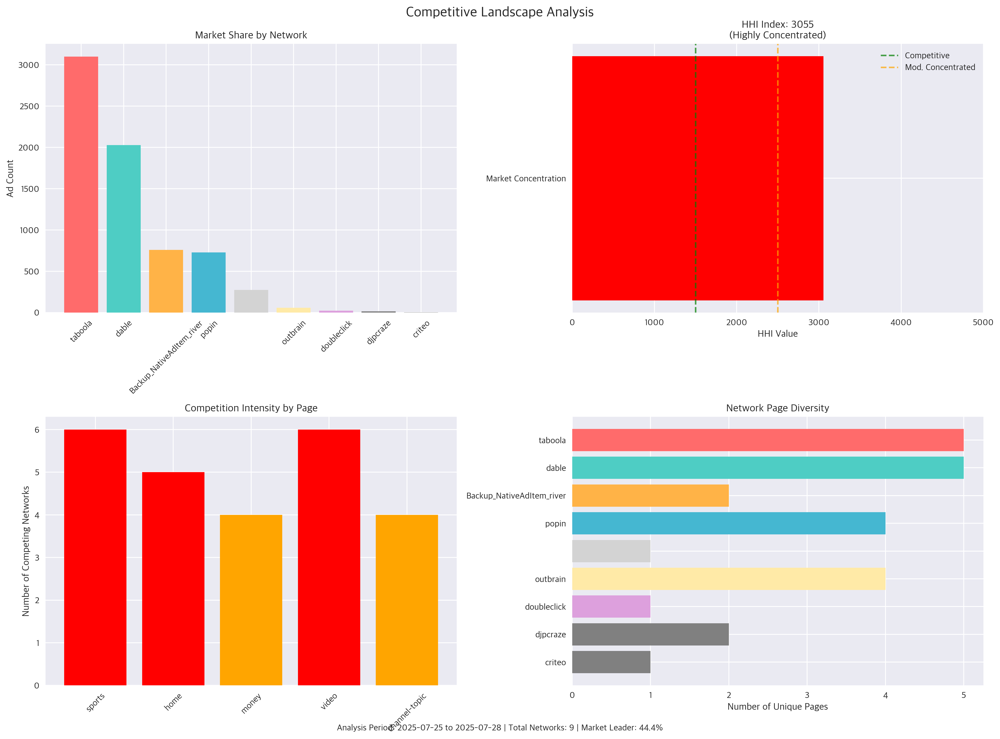

# MSN 광고 네트워크 분석 리포트

**분석 기간**: 2025년 07월 25일 ~ 2025년 07월 28일 (4일간)  
**분석 도구**: Python + Pandas + Google Gemini AI  
**총 광고 수**: 6,981개  
**네트워크 수**: 9개  
**페이지 수**: 5개  
**카테고리 수**: 12개  

---

## 📊 주요 시각화

### 네트워크 분포 및 경쟁 구조

### 시장 점유율 및 경쟁 분석

### 시간적 패턴 및 포지션 분석

---

## 🤖 AI 분석 인사이트

### 💡 시장 구조 분석

## MSN 광고 네트워크 시장 분석 보고서

본 보고서는 제공된 MSN 광고 네트워크 데이터를 기반으로 시장 구조, 주요 플레이어의 지위와 특징, 현재 시장 동향 및 잠재적 리스크 요소를 심층적으로 분석합니다.

---

### 1. 시장 구조 분석: 높은 집중도와 제한된 경쟁

제공된 HHI(Herfindahl-Hirschman Index) 지수 3055.23과 "Highly Concentrated"라는 집중도 레벨은 MSN 광고 네트워크 시장이 매우 높은 집중도를 보이며, 경쟁이 제한적임을 명확히 보여줍니다. 일반적으로 HHI 지수가 2500을 초과할 경우 '매우 집중된 시장'으로 분류됩니다. 이는 소수의 주요 플레이어가 시장의 대부분을 지배하고 있음을 의미합니다.

특히, 상위 3개 네트워크(Taboola, Dable, Backup_NativeAdItem_river)가 시장 점유율의 84.3%를 차지하고 있다는 점은 이러한 집중도를 더욱 강화합니다. 이 수치는 사실상 2개 주요 플레이어(Taboola, Dable)가 시장의 73.42%를 장악하고 있으며, 세 번째 플레이어부터 점유율이 급감하는 이중 과점(duopoly)에 가까운 형태를 띠고 있음을 시사합니다. 이러한 시장 구조는 신규 진입자에게 높은 진입 장벽으로 작용하며, 기존의 소수 지배적 사업자들에게 상당한 시장 지배력을 부여할 수 있습니다.

---

### 2. 주요 플레이어 분석: 지배적 리더와 강력한 추격자

**1. Taboola (시장 점유율 44.38%) - 압도적인 시장 리더:**
Taboola는 총 광고 수(3098개)와 시장 점유율에서 독보적인 1위를 차지하고 있습니다. 이는 Taboola가 MSN 광고 네트워크에서 가장 광범위한 캠페인을 운영하고 있거나, 가장 많은 광고주 및 퍼블리셔를 확보하고 있음을 의미합니다. `unique_pages`와 `unique_categories`에서 Dable과 동일한 수치를 보이며 `page_diversity`가 100%라는 점은 다양한 페이지와 카테고리에 걸쳐 폭넓은 광고를 집행하고 있음을 나타냅니다. 그러나 `avg_position`이 53.5로 상대적으로 높다는 점은 광고가 페이지 하단에 배치되는 경향이 있거나, 광고 노출 위치에 대한 최적화가 덜 이루어졌을 가능성을 시사합니다. 이는 방대한 물량을 바탕으로 한 양적 확장에 집중하는 전략일 수 있습니다.

**2. Dable (시장 점유율 29.04%) - 강력한 2인자이자 질적 우위 추격자:**
Dable은 Taboola에 이어 두 번째로 높은 점유율을 기록하며 시장의 핵심 플레이어임을 입증합니다. Taboola와 유사하게 높은 `unique_pages` 및 `unique_categories` (5개, 12개)와 100%의 `page_diversity`를 보여 넓은 광고 도달 범위를 자랑합니다. 특히 주목할 점은 `avg_position`이 34.0으로 Taboola(53.5)보다 현저히 낮다는 것입니다. 이는 Dable의 광고가 MSN 페이지 내에서 Taboola보다 더 상단에, 즉 더 눈에 띄는 위치에 노출되고 있음을 의미하며, 이는 광고 효율성 측면에서 Dable의 경쟁 우위가 될 수 있습니다. 양적 성장과 더불어 광고 품질 및 노출 위치 최적화에 강점을 둔 전략으로 분석됩니다.

**3. Backup_NativeAdItem_river (시장 점유율 10.86%) - 제한된 범위의 플레이어:**
세 번째로 큰 점유율을 차지하지만, 상위 2개 네트워크와는 상당한 격차를 보입니다. `unique_pages`(2개), `unique_categories`(6개), `page_diversity`(40%)에서 다른 주요 네트워크보다 현저히 낮은 수치를 보여, 광고 도달 범위가 제한적이거나 특정 니치 영역에 집중하는 경향을 나타냅니다. 또한 `avg_position`이 67.3으로 가장 높다는 점은 광고 노출 위치가 매우 열악하거나 잔여 인벤토리를 주로 활용하고 있을 가능성이 높습니다. 이는 특정 목적으로 사용되는 내부 네트워크이거나, 기술력 및 인벤토리 확보 경쟁에서 열위에 있는 플레이어로 추정됩니다.

**4. popin (시장 점유율 10.43%) - 고품질 노출 중심의 니치 플레이어:**
Backup_NativeAdItem_river와 유사한 점유율을 가지지만, 그 특성은 매우 다릅니다. `unique_pages`(4개), `unique_categories`(11개), `page_diversity`(80%)가 상대적으로 양호하며, 특히 `avg_position`이 33.5로 상위 5개 네트워크 중 가장 낮은(최고의) 위치를 기록합니다. 이는 Popin이 제한된 광고 수에도 불구하고, 매우 효과적이고 눈에 잘 띄는 위치에 광고를 노출시키는 데 집중하고 있음을 시사합니다. 고품질의 인벤토리 확보나 특정 프리미엄 영역에서의 강점을 가진 플레이어로 평가될 수 있습니다.

**5. (이름 없는 네트워크) (시장 점유율 3.91%) - 미확인 장기 꼬리(Long-tail) 기여자:**
가장 낮은 점유율을 차지하며, `unique_pages`(1개)와 `page_diversity`(20%)가 매우 낮아 특정 한정된 인벤토리에만 기여하는 소규모 또는 부수적인 네트워크로 판단됩니다.

---

### 3. 시장 동향: 품질 경쟁 심화와 전문성 강조

현재 MSN 광고 네트워크 시장은 Taboola와 Dable이라는 두 거대 플레이어를 중심으로 재편되고 있습니다.

*   **리더 간의 품질 경쟁 심화:** Taboola가 양적으로 시장을 지배하는 가운데, Dable은 더 우수한 평균 광고 노출 위치(avg_position)를 통해 질적인 우위를 추구하며 경쟁력을 확보하고 있습니다. 이는 단순히 많은 광고를 노출하는 것을 넘어, 얼마나 효과적인 위치에 노출하는지가 중요한 경쟁 요소로 부상하고 있음을 보여줍니다.
*   **고품질 인벤토리의 중요성:** Popin의 사례는 비록 점유율은 낮지만, 우수한 `avg_position`을 통해 특정 영역에서 높은 가치를 창출할 수 있음을 증명합니다. 이는 모든 광고 인벤토리가 동일한 가치를 가지는 것이 아니며, 광고주의 투자 대비 효과를 극대화할 수 있는 고품질 인벤토리 확보 및 최적화가 중요해지고 있음을 시사합니다.
*   **네이티브 광고의 지배력:** 대부분의 네트워크 이름이나 특성상, 콘텐츠에 자연스럽게 녹아드는 네이티브 광고 형태가 MSN 플랫폼의 주류 광고 트렌드임을 유추할 수 있습니다.
*   **다양한 카테고리/페이지 커버리지의 중요성:** 상위 네트워크들이 높은 `unique_categories`와 `page_diversity`를 보이는 것은, 다양한 콘텐츠 유형과 퍼블리셔를 통해 광범위한 사용자에게 도달하는 것이 성공적인 광고 네트워크 운영의 핵심임을 나타냅니다.

---

### 4. 리스크 요소: 시장 집중도 상승에 따른 잠재적 위험

높은 시장 집중도는 여러 가지 잠재적 리스크를 내포하고 있습니다.

*   **경쟁 감소 및 혁신 저해:** 소수의 지배적인 플레이어가 시장을 장악하면, 새로운 기술 도입이나 서비스 혁신에 대한 동기가 약화될 수 있습니다. 이는 장기적으로 시장의 성장 잠재력을 저해할 수 있습니다.
*   **광고주/퍼블리셔의 협상력 약화:** 지배적인 네트워크는 광고 가격이나 조건에 대해 더 큰 영향력을 행사할 수 있습니다. 이는 광고주에게는 비용 상승, 퍼블리셔에게는 수익 감소로 이어질 수 있으며, 대안이 줄어들기 때문에 협상력이 약화될 수 있습니다.
*   **시장 진입 장벽 증가:** 신규 광고 네트워크는 이미 확고한 시장 지위를 가진 기존 플레이어들과 경쟁하기 위해 막대한 자원과 노력이 필요합니다. 이는 시장의 역동성을 저해하고, 새로운 아이디어나 비즈니스 모델의 등장을 어렵게 만듭니다.
*   **시스템 의존성 증가:** MSN 플랫폼 입장에서는 소수 네트워크에 대한 의존도가 높아져, 이들 네트워크의 운영 정책 변경, 기술 문제 또는 서비스 중단이 플랫폼 전체의 광고 수익에 심각한 영향을 미칠 수 있습니다.
*   **담합 가능성 및 규제 강화 위험:** 집중된 시장에서는 기업 간 암묵적 또는 명시적 담합의 유혹이 커질 수 있으며, 이는 반독점 규제 당국의 감시와 개입을 초래할 수 있습니다.
*   **생태계 다양성 저해:** 소수의 거대 네트워크가 시장을 지배하면, 다양한 특성과 규모를 가진 소규모 또는 전문화된 광고 네트워크의 성장이 어렵게 되어 광고 생태계의 다양성이 저해될 수 있습니다.

---

### 🏆 경쟁 환경 분석

## MSN 광고 네트워크 경쟁 환경 분석 및 전략적 시사점

MSN 광고 네트워크는 현재 **매우 집중된(Highly Concentrated)** 시장 환경에서 운영되고 있으며, 이는 HHI 지수 3055.23과 상위 3개 네트워크가 시장 점유율의 84.3%를 차지한다는 점에서 명확히 드러납니다. 시장 리더는 44.4%의 압도적인 점유율을 보유하고 있으며, 총 9개의 경쟁자가 존재합니다. 이러한 데이터는 MSN이 치열한 경쟁 속에서 차별화된 전략을 수립해야 함을 시사합니다.

---

### 1. 경쟁 강도 평가 및 진입 장벽

현재 MSN 광고 네트워크가 직면한 시장은 **높은 경쟁 강도**를 보입니다. HHI 지수가 3000을 초과하고 상위 3개 네트워크가 시장의 대부분을 점유하는 것은 과점(Oligopoly)에 가까운 시장 구조를 나타냅니다. 이는 신규 진입자에게는 매우 높은 진입 장벽으로 작용합니다.

**진입 장벽:**
*   **규모의 경제 및 네트워크 효과:** 시장 리더와 상위권 플레이어들은 이미 방대한 광고주 및 퍼블리셔 네트워크를 구축하여 규모의 경제와 강력한 네트워크 효과를 누리고 있습니다. 이는 신규 진입자가 비용 효율적으로 인벤토리를 확보하거나 광고주를 유치하기 어렵게 만듭니다.
*   **데이터 및 기술력:** 정교한 타겟팅, 최적화, 성과 분석을 위한 대규모 데이터와 고도화된 AI/머신러닝 기술은 필수적입니다. 이를 구축하고 운영하는 데 막대한 투자와 시간이 소요됩니다.
*   **브랜드 인지도 및 신뢰:** 광고주와 퍼블리셔는 검증된 네트워크를 선호하는 경향이 있어, 신규 브랜드가 시장에서 신뢰를 얻기까지 오랜 시간이 걸립니다.
*   **특정 페이지의 높은 경쟁:** 'sports', 'home', 'video' 페이지는 각각 6개, 5개, 6개의 경쟁 네트워크와 수천 건의 광고(스포츠 페이지 4986건)로 인해 'High' 수준의 경쟁 강도를 보입니다. 이는 해당 영역에서 광고주를 유치하고 수익을 창출하기 매우 어렵다는 것을 의미합니다.

### 2. 차별화 전략 (경쟁사 및 MSN)

데이터는 각 네트워크의 고유한 전략을 명시적으로 제시하지 않지만, 시장의 집중도와 특정 페이지의 높은 경쟁 강도를 고려할 때 주요 플레이어들은 다음과 같은 방식으로 차별화를 꾀할 것으로 추정됩니다.

*   **시장 리더:** 압도적인 점유율(44.4%)을 바탕으로 **규모의 경제를 활용한 가격 경쟁력, 광범위한 퍼블리셔 네트워크를 통한 프리미엄 인벤토리 확보, 그리고 가장 방대한 데이터를 기반으로 한 정교한 타겟팅 및 성과 최적화**에 집중할 것입니다.
*   **상위 3개 네트워크:** 시장 리더를 추격하거나 특정 버티컬에서 강점을 구축하기 위해 **특정 오디언스 타겟팅 전문화, 독점적인 광고 형식 개발(예: 비디오 광고), 고품질 콘텐츠 연동형 네이티브 광고, 혹은 특정 산업군(예: 스포츠, 금융) 전문성**을 내세울 수 있습니다.
*   **MSN의 전략적 시사점:** MSN은 이러한 경쟁 환경에서 자체적인 강점(예: Microsoft 생태계 내 데이터, MSN 웹사이트의 고유 트래픽)을 활용하여 다음을 고려해야 합니다.
    *   **데이터 기반 초개인화 타겟팅:** 경쟁이 치열한 페이지(스포츠, 홈, 비디오)에서 더욱 정교한 사용자 데이터 분석을 통해 광고 효율성을 극대화해야 합니다.
    *   **프리미엄 및 독점 인벤토리 강화:** MSN 자체의 고유 트래픽을 활용하거나, 특정 콘텐츠 카테고리에서 독점적 광고 공간을 확보하여 광고주에게 가치를 제공해야 합니다.
    *   **광고 형식의 혁신:** 사용자 경험을 해치지 않으면서도 높은 참여율을 유도할 수 있는 새로운 광고 형식(예: 인터랙티브 광고, 증강 현실 광고)을 탐색해야 합니다.

### 3. 시장 기회

경쟁이 치열한 시장 속에서도 MSN은 다음과 같은 기회를 포착할 수 있습니다.

*   **틈새시장 공략 (Medium Competition Pages):** 'money' (4개 네트워크, 456개 광고) 및 'channel-topic' (4개 네트워크, 210개 광고) 페이지는 'Medium' 경쟁 강도를 보입니다. 비록 현재 광고 물량은 적지만, 이는 상대적으로 덜 포화된 시장임을 의미합니다. MSN은 이들 페이지의 특정 오디언스를 겨냥한 **전문적인 광고 솔루션이나 버티컬 특화 광고 네트워크**를 구축하여 효율적인 수익 모델을 창출할 수 있습니다. 예를 들어, 'money' 페이지에서는 특정 금융 상품 광고주를 위한 맞춤형 패키지를 제공하는 식입니다.
*   **데이터 및 AI 역량 강화:** Microsoft의 기술력을 바탕으로 시장 리더조차 아직 도달하지 못한 **더욱 정교하고 예측적인 광고 성과 분석 및 최적화**를 제공한다면, 프리미엄 광고주를 유치할 강력한 기회가 됩니다. 이는 단순히 노출을 넘어 실제 비즈니스 성과로 연결되는 솔루션을 제공하는 것입니다.
*   **개인정보 보호 강화에 대한 선제적 대응:** 쿠키리스 환경으로의 전환 등 개인정보 보호 규제가 강화되는 추세는 모든 플레이어에게 위협이지만, 동시에 이를 선제적으로 준비하고 사용자 프라이버시를 존중하면서도 효과적인 타겟팅을 제공하는 솔루션을 개발한다면 차별화된 강점이 될 수 있습니다.

### 4. 위협 요소

MSN이 직면한 주요 위협 요소는 다음과 같습니다.

*   **시장 리더 및 상위 3개 네트워크의 지배력 강화:** 시장 리더가 44.4%의 점유율을 가지고 있으며, 상위 3개 네트워크가 84.3%를 차지한다는 것은 이들이 시장 내에서 막강한 영향력을 행사하고 있음을 의미합니다. 이들은 규모의 경제를 통해 광고 단가를 더욱 낮추거나, 프리미엄 인벤토리를 독점하며 MSN의 경쟁 우위를 침식할 수 있습니다.
*   **경쟁 심화로 인한 수익성 악화:** 'sports', 'home', 'video'와 같이 경쟁이 높은 페이지에서는 광고 노출당 단가(eCPM)가 하락하거나, 광고주 유치를 위한 마케팅 비용이 증가하여 전반적인 수익성이 악화될 수 있습니다.
*   **기술 변화 및 개인정보 보호 규제:** 광고 업계는 끊임없이 변화하는 기술 환경(예: AI 발전)과 강화되는 개인정보 보호 규제(예: 쿠키 지원 중단)에 빠르게 적응해야 합니다. 이에 대한 대응이 늦어지면 시장 경쟁에서 뒤처질 수 있습니다.
*   **잠재적 인수 합병(M&A) 위협:** 시장 리더나 상위 경쟁자들이 다른 소규모 네트워크를 인수하여 시장 지배력을 더욱 공고히 할 경우, MSN의 성장 기회가 제한될 수 있습니다.

---

**결론적으로 MSN 광고 네트워크는 매우 강력한 경쟁 환경에 놓여 있으며, 단순한 물량 공세보다는 자체적인 데이터와 기술력을 활용한 차별화된 타겟팅, 특정 틈새시장 공략, 그리고 변화하는 규제 환경에 대한 선제적 대응을 통해 전략적 우위를 확보해야 할 것입니다.**

### ⏰ 시간적 트렌드 해석

MSN 광고 네트워크의 시간적 패턴 분석 결과, 전반적인 활동은 주중 낮 시간대에 집중되어 있으며, 각 네트워크별로도 차별화된 전략이 관찰됩니다.

---

### **MSN 광고 네트워크 시간적 패턴 분석 및 트렌드 해석**

MSN 광고 네트워크는 특정 시간대에 광고 노출이 집중되는 뚜렷한 시간 패턴을 보이며, 이는 사용자 행동과 네트워크별 전략에 따라 다르게 나타납니다.

**1. 피크 시간 분석: 12시 정오의 압도적 우위**

*   **가장 활발한 시간대**: 전체 광고 노출량은 **오후 12시(정오)**에 1,961개로 가장 높은 피크를 기록합니다. 이는 전체 시간대 중 단연 압도적인 수치로, 점심시간 또는 오전 업무를 마무리하며 정보 탐색이나 여가 활동을 위해 MSN과 같은 뉴스/콘텐츠 플랫폼에 접속하는 사용자들의 경향을 반영하는 것으로 보입니다.
*   **지속적인 활동**: 12시를 기점으로 13시(1,085개), 14시(1,378개), 15시(1,174개)까지 높은 광고 노출량을 유지하며, 오후 시간대에도 활발한 사용자 유입이 이어짐을 시사합니다.
*   **가장 조용한 시간대**: 반면, **오후 4시**는 78개로 가장 낮은 활동량을 보이며, 이는 업무 종료 또는 다른 활동으로의 전환 시점을 나타내는 것으로 해석됩니다.

**2. 주기성 패턴: 주중 낮 시간대 중심의 반복 패턴**

*   **일별 패턴의 높은 변동성**: 주어진 데이터(2025-07-25, 2025-07-28의 2일치 데이터)에서 일별 평균 광고량은 3,490.5개이나, 표준 편차가 2,000.4개로 매우 높습니다. 이는 일별 광고 볼륨이 크게 변동함을 의미하며, 특정 요일(예: 주말 대비 주중) 또는 캠페인 시작/종료 여부에 따라 일별 트래픽 편차가 심할 수 있음을 나타냅니다.
*   **시간별 패턴의 일관성**: 일별 변동성에도 불구하고, 일중 시간대별 패턴은 매우 일관적입니다. 오전 10시부터 광고 활동이 증가하기 시작하여 12시 정오에 정점을 찍고, 오후 3시까지 활발한 활동을 보인 후 4시에 급격히 감소합니다. 이러한 패턴은 일반적인 직장인이나 주간 활동 사용자들의 온라인 콘텐츠 소비 주기를 명확히 반영합니다.

**3. 네트워크별 전략: 주요 네트워크의 피크 타임 집중과 니치 전략**

*   **주류 네트워크의 정오 집중**: 'taboola' (3,098개)와 'dable' (2,027개)은 전체 광고량의 대부분을 차지하는 주요 네트워크이며, 이들 모두 12시(Taboola 31.5%, Dable 29.5%)를 핵심 피크 시간으로 활용합니다. 이는 전체 MSN 네트워크의 피크 시간과 일치하여, 가장 많은 사용자가 유입될 때 집중적으로 광고를 노출하는 전략을 사용함을 알 수 있습니다.
*   **오후 활동 집중 네트워크**: 'popin' (총 728개)은 14시(32.6%)와 15시(32.4%)에 가장 높은 비중을 보이며, 'Backup_NativeAdItem_river' (총 758개) 또한 14시(31.9%)에 가장 많은 광고를 노출하여 오후 시간대 공략에 집중하는 모습을 보입니다.
*   **이른 시간 및 니치 공략**: 'outbrain' (총 58개)은 11시(37.9%)에 가장 높은 비중을 보여 전반적인 피크보다 약간 이른 시간대에 집중합니다. 'doubleclick' (총 22개)과 'criteo' (총 2개)는 전체적으로 광고량이 적지만, 특히 'doubleclick'은 전체 트래픽이 가장 낮은 16시(40.9%)에 가장 높은 비율의 광고를 노출하는 특이점을 보입니다. 이는 해당 시간에 남아있는 특정 사용자층을 겨냥하거나, 경쟁이 적은 시간대의 기회를 활용하는 니치 전략으로 해석될 수 있습니다.

**4. 최적화 제안: 데이터 기반의 효율성 향상 방안**

*   **피크 시간대 예산 및 캠페인 집중**: 12시부터 15시까지의 황금 시간대에 가장 중요한 캠페인과 높은 입찰가를 설정하여 최대 노출 및 성과를 확보해야 합니다. 특히 Taboola와 Dable과 같은 대형 네트워크와의 협력을 강화해야 합니다.
*   **일별 변동성 관리**: 일별 광고량의 높은 표준편차에 대한 원인 분석이 필요합니다. 주중/주말 패턴, 특정 요일의 이벤트 등 변동 요인을 파악하여 이에 맞춰 예산을 탄력적으로 운영하거나, 트래픽이 낮은 요일에는 효율적인 광고를 배치하는 전략을 고려해야 합니다.
*   **비(非)피크 시간대 기회 모색**: 16시와 같이 트래픽이 급감하는 시간대에도 Doubleclick과 같은 일부 네트워크의 활동이 관찰되므로, 이 시간대에 잔류하는 사용자층의 특성을 분석하여 낮은 경쟁률을 이용한 효율적인 타겟팅 광고를 시도해 볼 수 있습니다. 다만, 극소량의 광고이므로 신중한 접근이 필요합니다.
*   **네트워크별 맞춤형 전략**: Outbrain처럼 이른 시간대에 강점을 보이는 네트워크에는 오전에 사용자에게 도달할 필요가 있는 캠페인을 할당하고, Popin처럼 오후에 강점을 보이는 네트워크에는 오후 사용자 행동 패턴에 맞는 메시지를 전달하는 등 각 네트워크의 피크 시간을 활용한 맞춤형 광고 스케줄링이 필요합니다.
*   **A/B 테스트 및 성과 측정**: 시간대별, 네트워크별로 다른 광고 소재, 메시지, 입찰 전략을 A/B 테스트하여 실제 사용자 반응과 전환율을 면밀히 측정하고, 이를 바탕으로 지속적인 최적화를 수행해야 합니다.

### 📈 전략적 제안사항

## MSN 광고 네트워크 종합 분석 결과 기반 전략적 제안사항

### Executive Summary

제공된 2025년 7월 25일부터 28일까지의 MSN 광고 네트워크 분석 결과에 따르면, 시장은 HHI 지수 3055.23으로 **고도로 집중된 형태**를 보이며, 상위 3개 네트워크(Taboola, Dable, Backup_NativeAdItem_river)가 전체 시장의 84.3%를 점유하고 있습니다. 특히 Taboola가 44.38%의 압도적인 시장 점유율로 선두를 달리고 있으나, 평균 광고 위치는 53.5로 경쟁사 Dable(34.0)이나 Popin(33.5)에 비해 낮은 경향을 보입니다. '스포츠' 페이지는 대부분의 네트워크가 집중하는 고경쟁 영역이며, 광고 활동은 12시에서 15시 사이에 가장 활발합니다. 이러한 분석을 바탕으로 MSN 광고 네트워크 내에서 경쟁 우위를 확보하고 효율성을 극대화하기 위한 전략을 제안합니다.

---

### 현재 시장 분석 요약 (Key Findings Recap)

*   **시장 지배력 및 집중도**: Taboola가 44.38%로 압도적인 시장 점유율을 가지고 있으며, Dable(29.04%)이 그 뒤를 잇습니다. 시장은 상위 3개 네트워크에 의해 84.3%가 장악된 '고도로 집중된' 형태입니다.
*   **광고 위치 경쟁력**: Dable, Popin, Outbrain 등은 평균 광고 위치가 30대 중반으로 우수하나, 시장 선두주자인 Taboola와 Backup_NativeAdItem_river는 각각 53.5, 67.3으로 하위권에 머물고 있습니다. Doubleclick은 낮은 볼륨에도 불구하고 최상단(평균 11.7)에 집중하는 전략을 사용합니다.
*   **페이지 및 카테고리 특화**: 대부분의 주요 네트워크(Taboola, Dable, Backup_NativeAdItem_river, Popin)가 '스포츠' 페이지 및 '스포츠/축구' 카테고리에 집중하고 있어 해당 영역의 경쟁 강도가 높습니다. 반면 '비디오' 페이지는 경쟁이 덜하나 광고 볼륨이 적습니다.
*   **시간대별 활동 패턴**: 12시가 피크 시간대이며, 10시부터 15시까지 광고 활동이 활발합니다. 16시는 가장 조용한 시간대입니다. 네트워크별로 피크 시간대가 다소 상이합니다.
*   **데이터 한계**: 분석 기간이 4일로 짧아 일일 변동성이 크다는 점을 고려해야 합니다.

---

### 전략적 제안사항

#### 1. 단기 전략 (1-3개월): 즉시 실행 가능한 개선 방안

*   **광고 위치 최적화 및 경쟁사 벤치마킹**:
    *   **실행 방안**: 평균 광고 위치가 우수한 Dable, Popin의 입찰 전략 및 광고 소재를 분석하여 우리 캠페인에 적용합니다. 특히 '스포츠' 페이지에서 Taboola가 낮은 위치를 차지하는 약점을 파고들어, 주요 키워드 및 타겟에 대한 입찰가를 상향 조정하여 상위 노출을 노립니다.
    *   **기대 효과**: 즉각적인 광고 가시성 개선 및 클릭률(CTR) 향상.
*   **피크 타임 집중 공략**:
    *   **실행 방안**: 전체 네트워크에서 광고 활동이 가장 활발한 12:00~15:00 시간대에 예산을 집중하고 입찰가를 상향 조정합니다. 이 시간대에 노출되는 광고 소재를 더욱 매력적으로 개선하여 사용자 참여를 유도합니다.
    *   **기대 효과**: 높은 트래픽 시간대에 광고 효율 극대화, 단기 성과 증대.
*   **캠페인 성과 미분류 네트워크 식별 및 재정비**:
    *   **실행 방안**: 분석 결과에 `""` (공백)으로 표시된 네트워크 (총 273건, 시장 점유율 3.91%)의 정체를 파악하고, 해당 네트워크의 운영 현황 및 성과를 면밀히 검토합니다. 낮은 페이지 다양성(20%)과 분산된 광고 위치(평균 56.6)를 개선하거나, 예산을 효율적인 다른 네트워크로 재분배합니다.
    *   **기대 효과**: 숨겨진 비효율성 제거, 예산 배분의 투명성 및 효율성 증대.

#### 2. 중기 전략 (3-12개월): 경쟁력 강화를 위한 핵심 과제

*   **고경쟁 페이지 내 틈새시장 발굴 및 다각화**:
    *   **실행 방안**: '스포츠' 페이지 내에서도 덜 포화된 하위 카테고리(예: 특정 스포츠 리그, 스포츠 장비 등)를 발굴하고 타겟팅을 정교화합니다. 또한, '홈', '머니', '채널-토픽' 등 경쟁 강도가 중간 수준인 페이지로 광고 노출을 확대하여 잠재 고객을 발굴하고 포트폴리오를 다각화합니다.
    *   **기대 효과**: 경쟁 완화 및 새로운 잠재 고객 확보, 장기적인 캠페인 안정성 확보.
*   **네트워크별 맞춤형 전략 수립**:
    *   **실행 방안**: 각 네트워크의 특성(예: Taboola의 높은 점유율 대비 낮은 위치, Dable의 우수한 위치 등)을 고려하여 네트워크별 맞춤형 예산 배분 및 입찰 전략을 수립합니다. Doubleclick처럼 최상단 노출에 강점이 있는 네트워크의 활용도를 검토하고, 특정 페이지/카테고리 특화 전략을 모색합니다.
    *   **기대 효과**: 네트워크별 효율성 극대화, 전체 캠페인 ROI 향상.
*   **동적 광고 소재 및 A/B 테스트 강화**:
    *   **실행 방안**: 다양한 광고 소재(헤드라인, 이미지, CTA)를 개발하고 A/B 테스트를 상시적으로 진행하여 클릭률(CTR) 및 전환율(CVR)이 높은 소재를 식별합니다. 시간대별, 페이지별 최적의 소재를 동적으로 노출하는 시스템을 구축합니다.
    *   **기대 효과**: 광고 효과의 지속적인 개선, 사용자 반응 데이터 축적.

#### 3. 장기 전략 (1년 이상): 시장 지위 확보를 위한 장기 로드맵

*   **사용자 행동 기반의 심층 타겟팅**:
    *   **실행 방안**: 단순 페이지/카테고리를 넘어 MSN 내 사용자들의 검색 기록, 콘텐츠 소비 패턴 등 행동 데이터를 분석하여 초개인화된 광고 타겟팅 전략을 수립합니다. 이를 위해 MSN의 데이터 분석 기능 활용 또는 외부 데이터 연동을 검토합니다.
    *   **기대 효과**: 광고 효율의 혁신적인 개선, 높은 전환율 달성, 경쟁 우위 심화.
*   **브랜드 인지도 및 프리미엄 광고 지면 확보**:
    *   **실행 방안**: MSN과의 직접적인 협력을 통해 고정 노출, 독점 광고 지면 등 프리미엄 인벤토리를 확보하는 방안을 논의합니다. 이는 단기적인 성과를 넘어 장기적인 브랜드 인지도 향상과 충성 고객 확보에 기여합니다.
    *   **기대 효과**: 브랜드 이미지 강화, 안정적인 트래픽 확보, 시장 내 독점적 위치 선점 가능성.
*   **다채널 통합 광고 전략 (Omni-channel Ad Strategy)**:
    *   **실행 방안**: MSN 광고 네트워크 외 다른 매체(검색, 소셜 미디어, 기타 디스플레이 네트워크)의 광고 데이터를 통합 분석하여, 사용자 여정 전반에 걸친 유기적인 광고 캠페인을 설계합니다. MSN을 통해 유입된 고객의 타 채널 행동을 추적하여 전체 마케팅 퍼널을 최적화합니다.
    *   **기대 효과**: 전반적인 마케팅 효율성 극대화, 고객 생애 가치(LTV) 증대.

---

### 모니터링 지표 (Key Performance Indicators - KPIs)

전략 실행의 성과를 측정하기 위한 핵심 지표는 다음과 같습니다:

1.  **평균 광고 위치 (Average Ad Position)**:
    *   목표: 전체 평균 광고 위치 40 이하 달성, 주요 경쟁 페이지(스포츠, 홈)에서는 30대 중반 유지.
2.  **클릭률 (Click-Through Rate, CTR)**:
    *   목표: 페이지 및 카테고리별 CTR 벤치마크 대비 10% 이상 개선.
3.  **전환율 (Conversion Rate, CVR)**:
    *   목표: 특정 캠페인 목표(구매, 회원가입 등)에 따른 CVR 지속적인 상향.
4.  **광고 비용 효율 (Cost Per Conversion, CPC / CPA)**:
    *   목표: 특정 시간대, 페이지, 네트워크에서 CPC 및 CPA 최소화.
5.  **시장 점유율 (Market Share)**:
    *   목표: Top 2 네트워크(Taboola, Dable)의 점유율 추이 모니터링 및 우리 광고의 전체 노출/클릭 점유율 증대.
6.  **페이지 다양성 (Page Diversity)**:
    *   목표: '스포츠' 외 다른 경쟁도 중하위 페이지(홈, 머니, 채널-토픽)에서의 광고 노출 비중 점진적 확대.
7.  **일일/시간대별 광고 성과 변동성**:
    *   목표: 피크 타임 집중 전략을 통한 효율성 증대 및 데이터 변동성 관리.

이러한 지표들을 지속적으로 모니터링하고 분석하여, 시장 변화에 능동적으로 대응하고 전략을 유연하게 조정하는 것이 성공적인 MSN 광고 네트워크 운영의 핵심이 될 것입니다.

---

## 📋 분석 방법론

### 데이터 소스
- **데이터베이스**: MySQL (ad_contents.MSN_AD_CARDS)
- **분석 도구**: Python, pandas, matplotlib, seaborn
- **AI 분석**: Google Gemini 2.5 Flash

### 주요 분석 지표
- **HHI (허핀달-허쉬만 지수)**: 시장 집중도 측정
- **시장 점유율**: 네트워크별 광고 수 비율  
- **포지션 분석**: 광고 위치별 분포 패턴
- **시간적 패턴**: 시간대별/일별 활동 트렌드

### 시각화 차트
1. **네트워크-페이지 히트맵**: 네트워크별 페이지 집중도
2. **네트워크-카테고리 히트맵**: 카테고리별 전문화 패턴
3. **시장 점유율 파이차트**: 네트워크별 시장 지배력
4. **경쟁 분석 대시보드**: 종합 경쟁 구조 분석
5. **시간별 트렌드**: 광고 노출량 시계열 변화
6. **포지션 분석**: 광고 위치 전략 비교

---

## 🔗 추가 자료

- [원본 데이터 쿼리 결과](./raw_data_summary.json) (개발용)
- [이미지 폴더](./images/) - 고해상도 차트 다운로드

---

*리포트 생성일: {datetime.now().strftime('%Y-%m-%d %H:%M:%S')}*  
*분석 엔진: MSN Ads Info Graphic Generator v1.0*  
*AI 파트너: Google Gemini 2.5*
