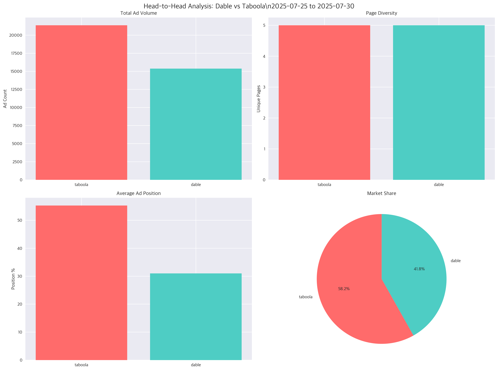
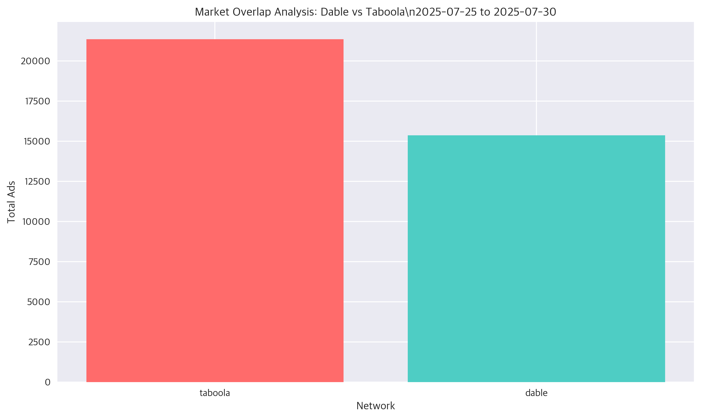
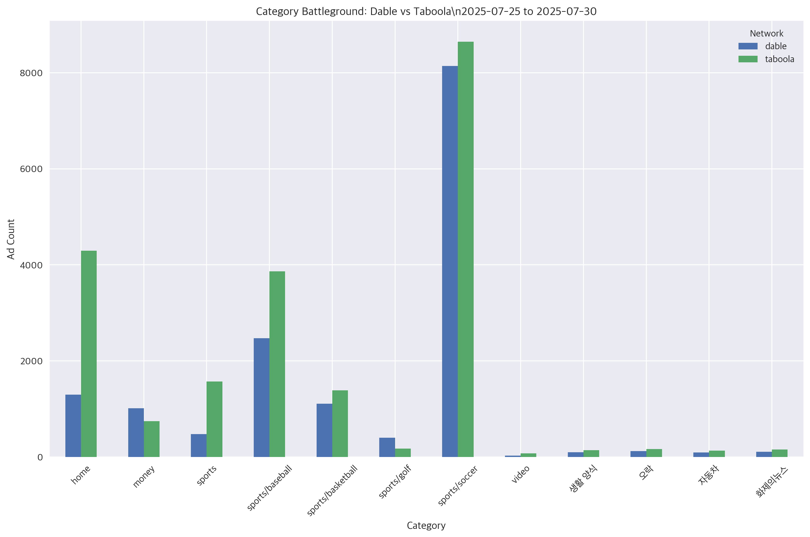
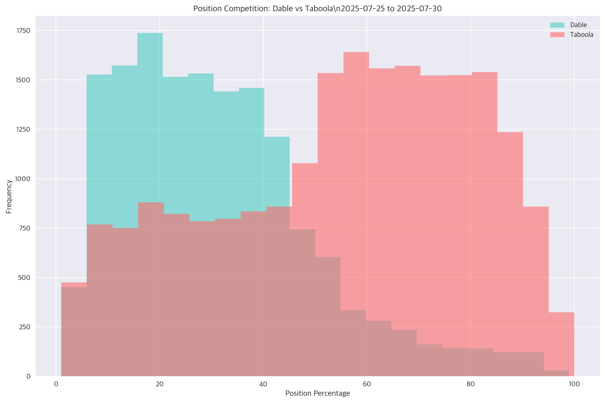
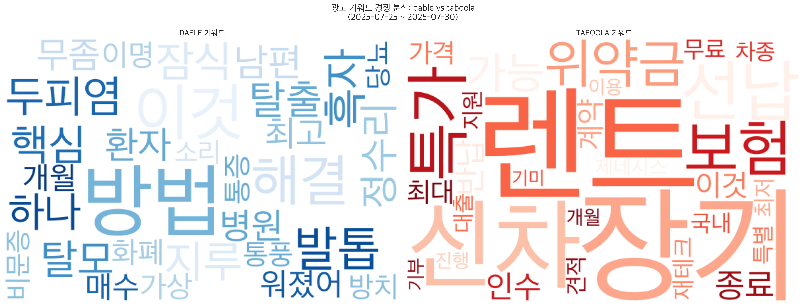
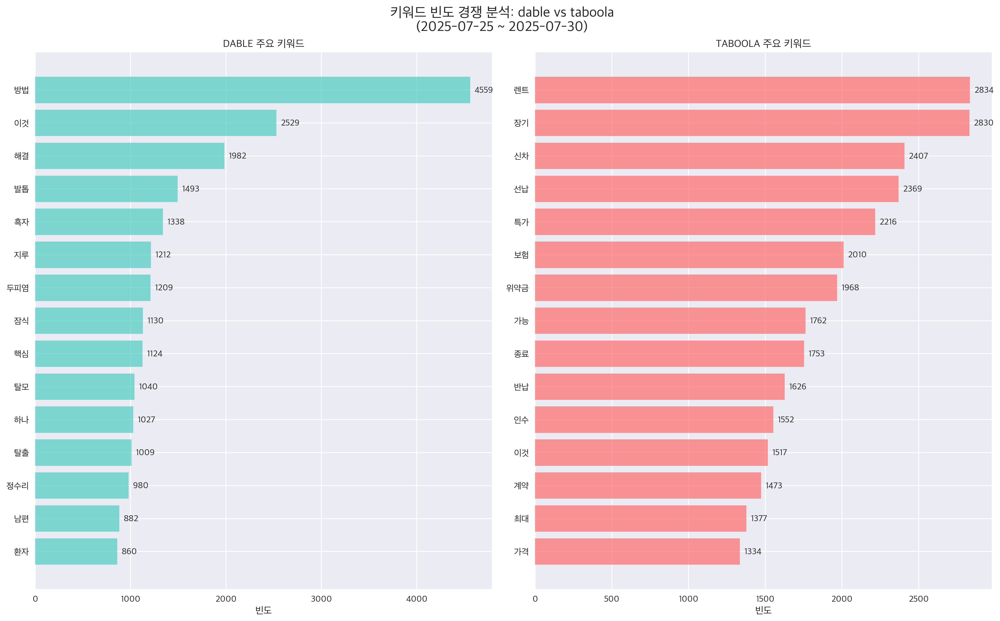

# MSN 광고 네트워크 분석 리포트

**분석 기간**: 2025년 07월 25일 ~ 2025년 07월 30일 (6일간)  
**분석 도구**: Python + Pandas + Google Gemini AI  
**총 광고 수**: 36,736개  
**네트워크 수**: 2개  
**페이지 수**: 5개  
**카테고리 수**: 12개  

---

## 📊 주요 시각화

### 네트워크 분포 및 경쟁 구조

### 시장 점유율 및 경쟁 분석

### 시간적 패턴 및 포지션 분석

### 광고 문구 분석

---

## 🤖 AI 분석 인사이트

### 💡 시장 구조 분석

# LLM 분석 비활성화

Gemini API가 설정되지 않았거나 비활성화되었습니다.

### 🏆 경쟁 환경 분석

# 경쟁 분석 비활성화

기본 통계 분석만 제공됩니다.

### ⏰ 시간적 트렌드 해석

# 시간 트렌드 분석 비활성화

기본 시계열 차트를 참조하세요.

### 📈 전략적 제안사항

# 전략 제안 비활성화

수동으로 분석 결과를 해석하세요.

---

## 📋 분석 방법론

### 데이터 소스
- **데이터베이스**: MySQL (ad_contents.MSN_AD_CARDS)
- **분석 도구**: Python, pandas, matplotlib, seaborn
- **AI 분석**: Google Gemini 2.5 Flash

### 주요 분석 지표
- **HHI (허핀달-허쉬만 지수)**: 시장 집중도 측정
- **시장 점유율**: 네트워크별 광고 수 비율  
- **포지션 분석**: 광고 위치별 분포 패턴
- **시간적 패턴**: 시간대별/일별 활동 트렌드

### 시각화 차트
1. **네트워크-페이지 히트맵**: 네트워크별 페이지 집중도
2. **네트워크-카테고리 히트맵**: 카테고리별 전문화 패턴
3. **시장 점유율 파이차트**: 네트워크별 시장 지배력
4. **경쟁 분석 대시보드**: 종합 경쟁 구조 분석
5. **시간별 트렌드**: 광고 노출량 시계열 변화
6. **포지션 분석**: 광고 위치 전략 비교
7. **광고 문구 워드클라우드**: 주요 키워드 시각화
8. **키워드 빈도 분석**: 광고 문구 키워드 순위
9. **제목 특성 분석**: 네트워크별 광고 문구 패턴

---

## 🔗 추가 자료

- [📋 상세 분석 리포트](./report.md) - 제목 분석 포함 완전한 리포트
- [원본 데이터 쿼리 결과](./raw_data_summary.json) (개발용)
- [이미지 폴더](./images/) - 고해상도 차트 다운로드

---

*리포트 생성일: {datetime.now().strftime('%Y-%m-%d %H:%M:%S')}*  
*분석 엔진: MSN Ads Info Graphic Generator v1.0*  
*AI 파트너: Google Gemini 2.5*
