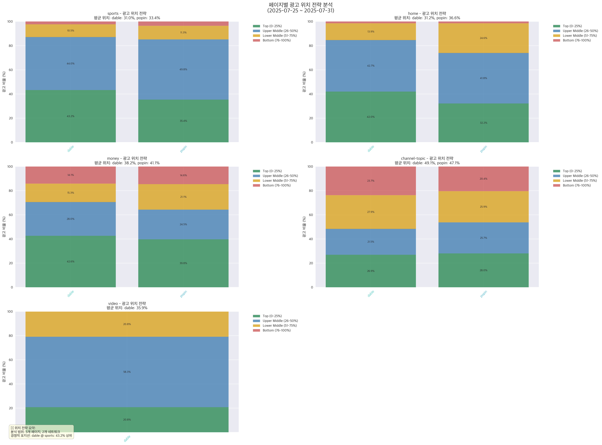

# MSN 광고 네트워크 분석 리포트

**분석 기간**: 2025년 07월 25일 ~ 2025년 07월 31일 (7일간)  
**분석 유형**: dable vs popin 2자 경쟁 분석  
**총 광고 수**: 28,738개  
**네트워크 수**: 2개  
**페이지 수**: 5개  
**카테고리 수**: 12개  

---

## 📊 생성된 시각화 자료

### 🌐 네트워크 분석

#### 네트워크 간 직접 비교

두 네트워크의 직접적인 경쟁 구조

#### 시장 중복 분석

네트워크 간 시장 중복도 분석

#### 카테고리별 경쟁 구조

카테고리별 네트워크 경쟁 현황

### 🔤 키워드 및 광고 문구 분석

#### 경쟁 키워드 워드클라우드

경쟁 네트워크 간 키워드 비교

#### 경쟁 키워드 비교 분석

네트워크 간 키워드 사용 전략 비교

### 📄 페이지별 상세 분석

#### Sports 페이지 키워드 분석

Sports 페이지에서의 키워드 사용 패턴

#### Home 페이지 키워드 분석

Home 페이지에서의 키워드 사용 패턴

#### Money 페이지 키워드 분석

Money 페이지에서의 키워드 사용 패턴

#### Channel-Topic 페이지 키워드 분석

Channel-Topic 페이지에서의 키워드 사용 패턴

#### Video 페이지 키워드 분석

Video 페이지에서의 키워드 사용 패턴

#### 페이지별 광고 위치 전략

각 페이지에서의 네트워크별 위치 전략

### 📍 위치 및 전략 분석

#### 포지션 경쟁 분석

네트워크 간 위치 경쟁 양상

### ⏰ 시간적 패턴 분석

#### 시간대별 경쟁 강도

시간대별 네트워크 간 경쟁 강도

**총 13개의 시각화 차트가 생성되었습니다.**
---

## 📋 분석 방법론

### 데이터 소스
- **데이터베이스**: MySQL (ad_contents.MSN_AD_CARDS)
- **분석 도구**: Python, pandas, matplotlib, seaborn, kiwipiepy

### 주요 분석 지표
- **HHI (허핀달-허쉬만 지수)**: 시장 집중도 측정
- **시장 점유율**: 네트워크별 광고 수 비율  
- **포지션 분석**: 광고 위치별 분포 패턴 (0-25%, 26-50%, 51-75%, 76-100%)
- **시간적 패턴**: 시간대별/일별 활동 트렌드
- **키워드 분석**: 한국어 자연어 처리를 통한 광고 제목 키워드 추출
- **페이지별 분석**: 각 페이지(sports, home, money, channel-topic)의 특화 전략

### 시각화 기술
- **동적 차트 생성**: 실제 생성된 모든 차트를 자동으로 포함
- **카테고리별 분류**: 네트워크, 키워드, 페이지별, 위치, 시간 분석으로 구분
- **반응형 레이아웃**: GitHub Pages 호환 마크다운 구조

---

## 🔗 추가 자료

- [📋 상세 분석 리포트](./report.md) - 제목 분석 포함 완전한 리포트
- [원본 데이터 쿼리 결과](./raw_data_summary.json) (개발용)
- [이미지 폴더](./images/) - 고해상도 차트 다운로드

---

*리포트 생성일: {datetime.now().strftime('%Y-%m-%d %H:%M:%S')}*  
*분석 엔진: MSN Ads Info Graphic Generator v2.0*  
