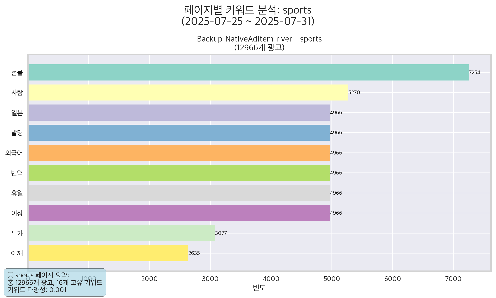
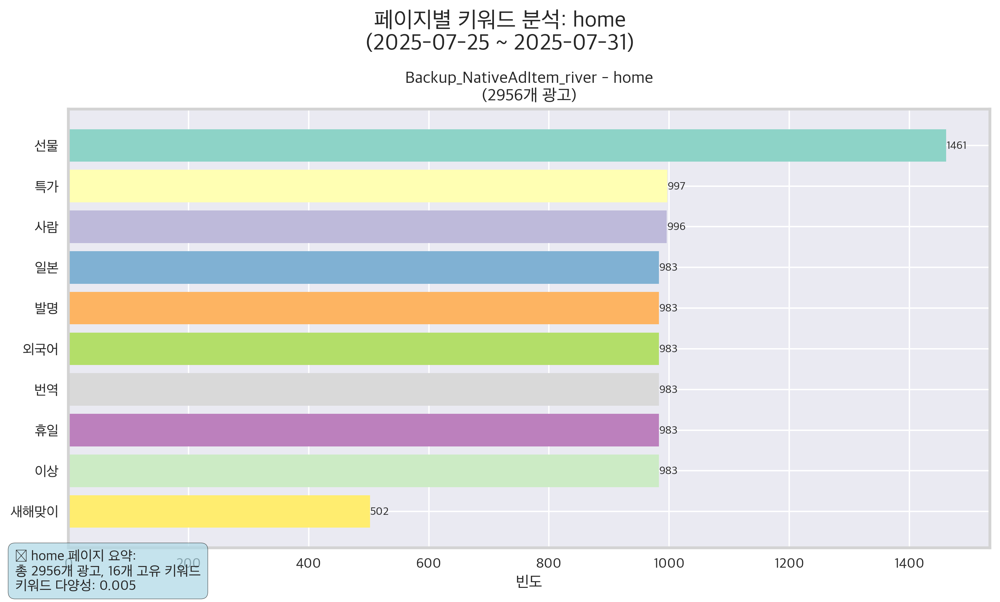
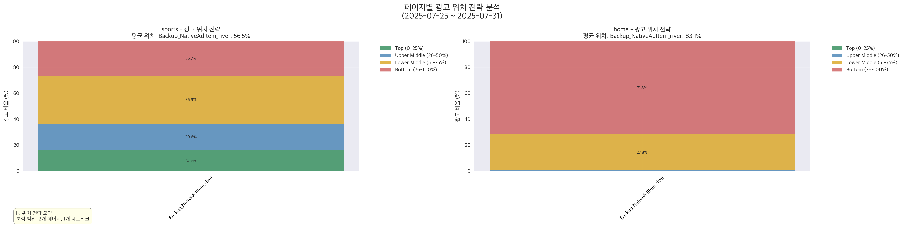

# MSN 광고 네트워크 개별 네트워크 분석 리포트

**분석 기간**: 2025년 07월 25일 ~ 2025년 07월 31일 (7일간)  
**분석 대상**: backup_nativeaditem_river  
**분석 유형**: 개별 네트워크 분석  

---

## 📊 데이터 개요

- **총 광고 수**: 15,922개
- **네트워크 수**: 1개  
- **페이지 수**: 2개
- **카테고리 수**: 6개
- **분석 기간**: 2025-07-25 12:20:18 ~ 2025-07-31 23:47:47

## 🎯 네트워크 전략 분석

### 시장 점유율

### 전문화 영역

## ⏰ 시간적 패턴 분석

### 활동 패턴
- **피크 시간**: 12:00 (5401개 광고)
- **일평균 광고**: 18570.6개

## 🏆 경쟁 환경 분석

### 시장 구조
- **시장 집중도**: Highly Concentrated
- **HHI 지수**: 3093.7
- **상위 3개 점유율**: 89.2%

## 📝 광고 문구 분석

## 🔍 backup_nativeaditem_river 페이지별 상세 분석

### 📋 페이지별 키워드 전략

단일 네트워크에서 각 페이지별로 나타나는 키워드 특성을 분석합니다.

#### sports 페이지 키워드 분석

sports 페이지에서의 네트워크별 주요 키워드 사용 패턴

#### home 페이지 키워드 분석

home 페이지에서의 네트워크별 주요 키워드 사용 패턴

### 📍 페이지별 광고 위치 전략

각 페이지에서의 네트워크별 광고 위치 전략을 분석합니다.

광고 위치 분포를 통해 각 네트워크의 경쟁 전략을 파악할 수 있습니다:
- **상위 25%**: 프리미엄 위치 선점 전략
- **중상위 26-50%**: 균형잡힌 노출 전략
- **중하위 51-75%**: 안정적 노출 확보
- **하위 76-100%**: 광범위 커버리지 전략

### 💡 페이지별 분석 인사이트

**backup_nativeaditem_river 네트워크의 페이지별 특성:**
- 각 페이지별로 특화된 키워드 전략 확인
- 페이지 특성에 맞는 광고 위치 선택 패턴 분석
- 타겟 오디언스에 따른 메시지 최적화 전략 파악

## 💡 핵심 인사이트

1. Market leader: Backup_NativeAdItem_river with 100.0% market share
2. Backup_NativeAdItem_river shows strong market dominance
3. Specialized networks: Backup_NativeAdItem_river (sports)
4. Peak advertising hour: 12:00 with 5401 ads
5. Quietest hour: 17:00 with 2941 ads

## 🔬 분석 방법론

### 데이터 수집
- **소스**: MSN_AD_CARDS 테이블 (MySQL)
- **범위**: 지정된 날짜 범위 및 네트워크
- **접근**: READ-ONLY 연결

### 분석 지표
- **시장 점유율**: 네트워크별 광고 수 비율
- **전문화 지수**: 카테고리별 집중도 측정
- **시간적 패턴**: 시간대별 활동 분포
- **키워드 분석**: 광고 문구 자연어 처리

### 기술 스택
- **언어**: Python 3.10+
- **라이브러리**: pandas, matplotlib, seaborn, kiwipiepy
- **데이터베이스**: MySQL (pymysql)

---

*리포트 생성일: 2025-08-01 09:04:44*  
*분석 도구: MSN Ads Info Graphic Generator*  
