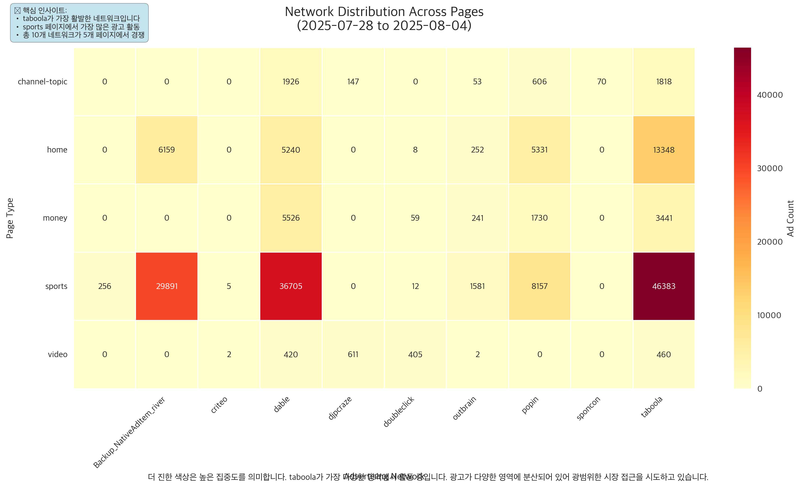
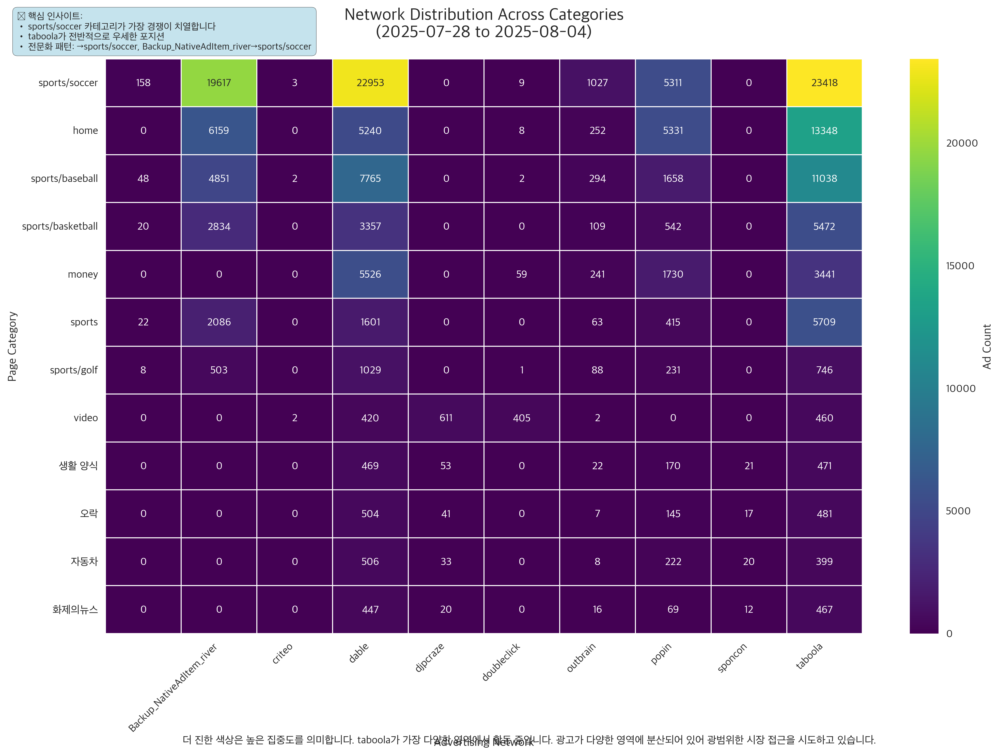
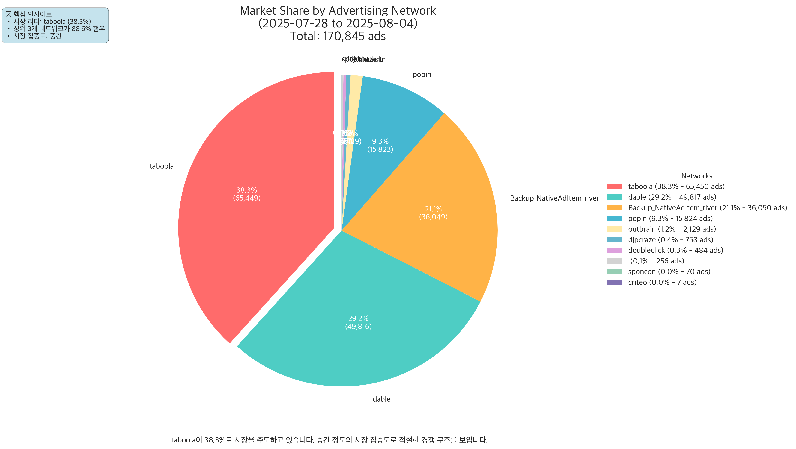
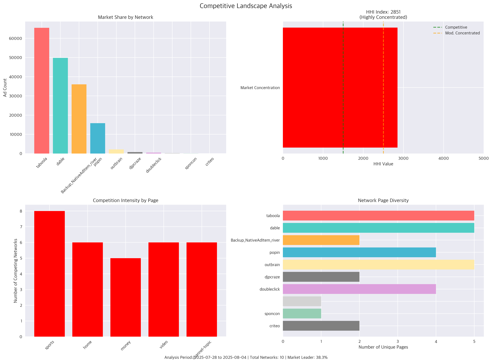
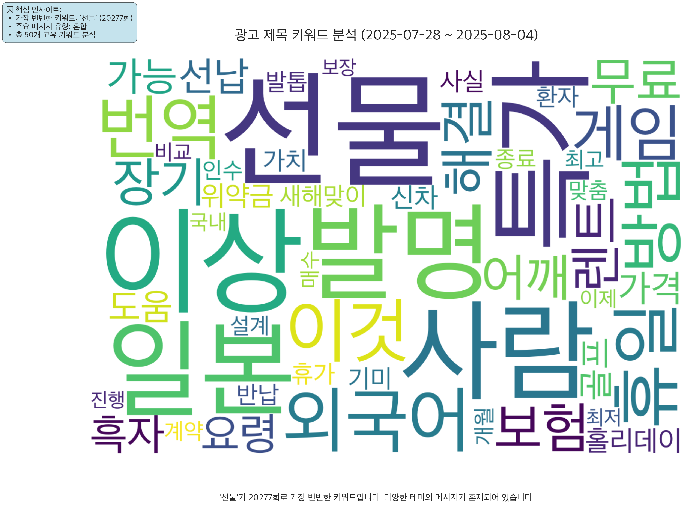
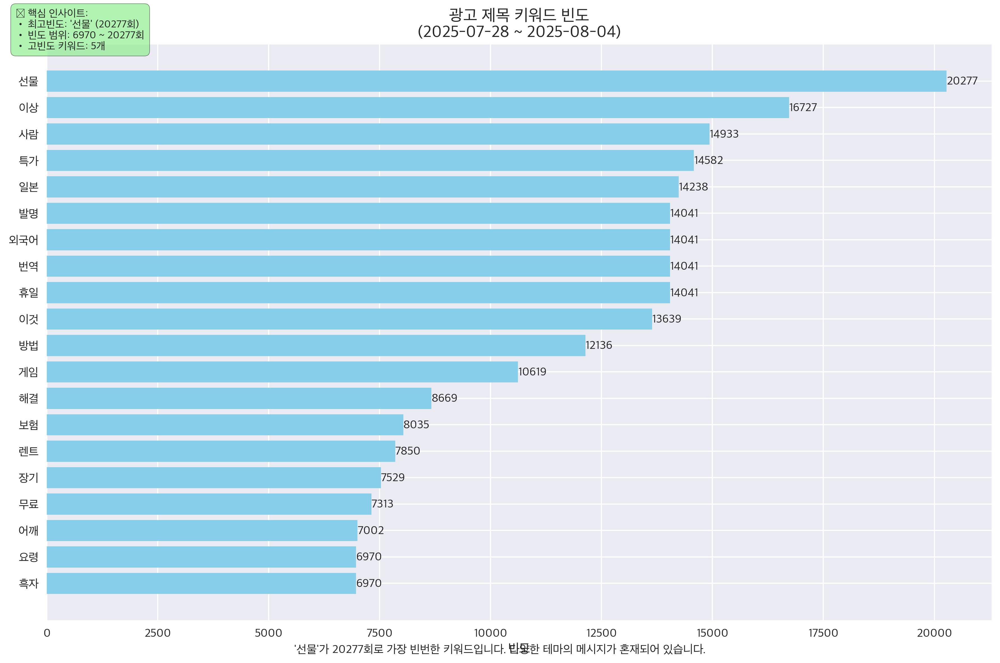
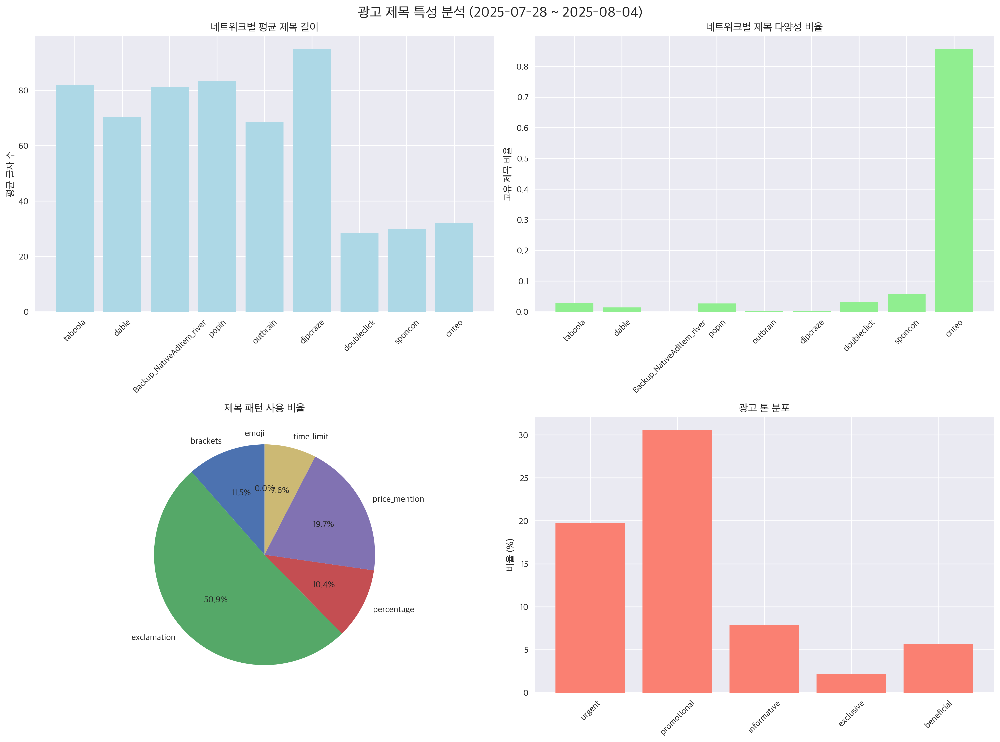
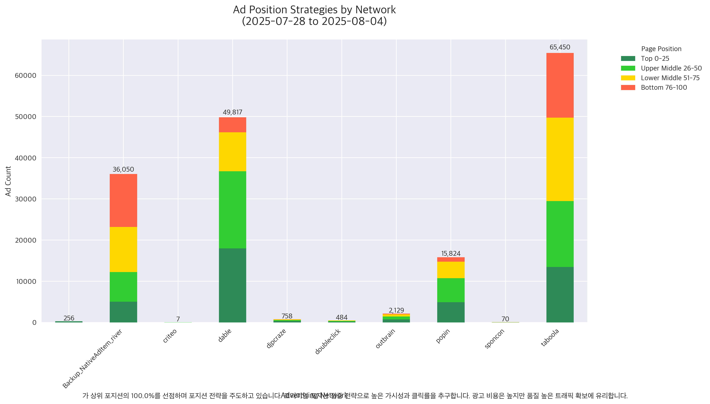
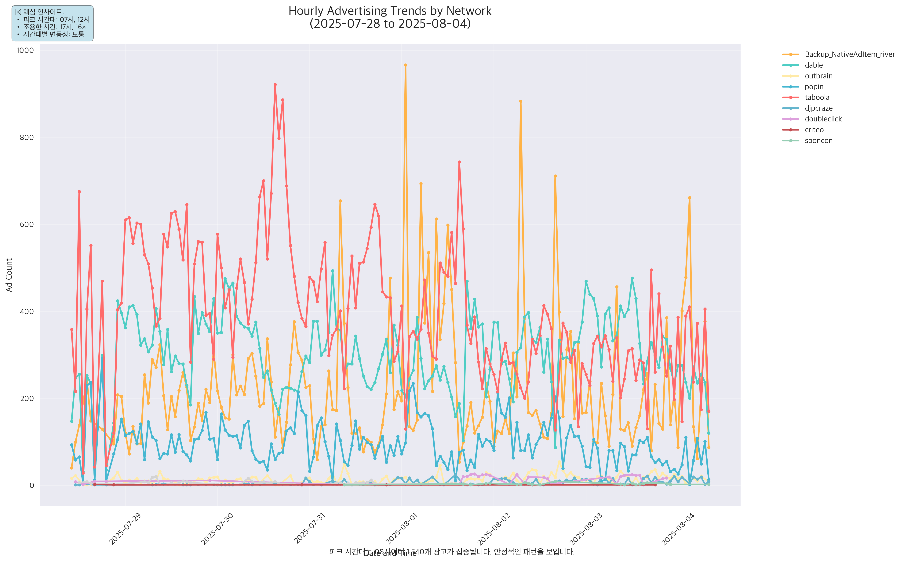

# MSN 광고 네트워크 분석 리포트

**분석 기간**: 2025년 07월 28일 ~ 2025년 08월 04일 (8일간)  
**분석 유형**: 전체 네트워크 종합 분석  
**총 광고 수**: 170,845개  
**네트워크 수**: 10개  
**페이지 수**: 5개  
**카테고리 수**: 12개  

---

## 📊 생성된 시각화 자료


### 🌐 네트워크 분석

#### 네트워크-페이지 분포 히트맵



각 네트워크가 집중하는 페이지 분포

#### 네트워크-카테고리 분포 히트맵



네트워크별 카테고리 전문화 패턴

#### 시장 점유율



네트워크별 광고 시장 점유율

#### 경쟁 환경 분석



시장 구조와 경쟁 강도 종합 분석


### 🔤 키워드 및 광고 문구 분석

#### 광고 제목 키워드 워드클라우드



광고 제목에서 추출한 주요 키워드

#### 키워드 빈도 분석



상위 키워드의 사용 빈도

#### 제목 특성 분석



네트워크별 광고 제목 특성 비교


### 📍 위치 및 전략 분석

#### 포지션 분석



네트워크별 광고 위치 전략


### ⏰ 시간적 패턴 분석

#### 시간별 트렌드



하루 중 시간대별 광고 노출량 변화


**총 9개의 시각화 차트가 생성되었습니다.**

### 📖 광고 톤 키워드 패턴

**분석에 사용된 톤 카테고리별 키워드**:

```
tone_patterns = {
    'urgent': r'지금|바로|즉시|긴급|서둘러|마감|종료|한정',
    'promotional': r'할인|특가|무료|이벤트|프로모션|%|원',
    'informative': r'안내|소개|정보|방법|가이드',
    'exclusive': r'특별|VIP|프리미엄|고급|전용|회원',
    'beneficial': r'혜택|이득|절약|지원|보장|수익'
}
```

---

## 📋 분석 방법론

### 데이터 소스
- **데이터베이스**: MySQL (ad_contents.MSN_AD_CARDS)
- **분석 도구**: Python, pandas, matplotlib, seaborn, kiwipiepy

### 주요 분석 지표
- **HHI (허핀달-허쉬만 지수)**: 시장 집중도 측정
- **시장 점유율**: 네트워크별 광고 수 비율  
- **포지션 분석**: 광고 위치별 분포 패턴 (0-25%, 26-50%, 51-75%, 76-100%)
- **시간적 패턴**: 시간대별/일별 활동 트렌드
- **키워드 분석**: 한국어 자연어 처리를 통한 광고 제목 키워드 추출
- **페이지별 분석**: 각 페이지(sports, home, money, channel-topic)의 특화 전략

### 시각화 기술
- **동적 차트 생성**: 실제 생성된 모든 차트를 자동으로 포함
- **카테고리별 분류**: 네트워크, 키워드, 페이지별, 위치, 시간 분석으로 구분
- **반응형 레이아웃**: GitHub Pages 호환 마크다운 구조

---

## 🔗 추가 자료

- [원본 데이터 쿼리 결과](./raw_data_summary.json) (개발용)
- [이미지 폴더](./images/) - 고해상도 차트 다운로드

---

*리포트 생성일: {datetime.now().strftime('%Y-%m-%d %H:%M:%S')}*  
*분석 엔진: MSN Ads Info Graphic Generator v2.0*  
